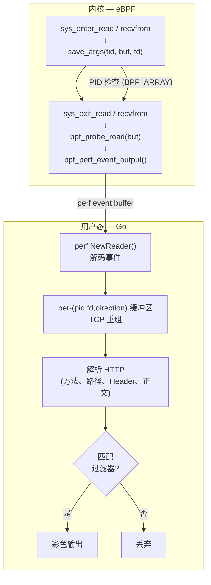

# pugi：基于 eBPF 的无侵入 HTTP 流量观测工具

pugi 通过 tracepoint 挂接到目标进程的系统调用，重建 HTTP 报文并输出到终端。内置一系列过滤功能，精准定位关心的请求和 / 或响应。

```bash
$ sudo pugi --pid 18401 --path-prefix /api/v1 --method POST
Watching PID 18401
Attached 8 tracepoints — capturing HTTP traffic...
   Press Ctrl+C to stop

[IN] 17:23:41.201 pid=18401 fd=32
  POST /api/v1/users HTTP/1.1
  Host: localhost:8080
  Content-Type: application/json
  Content-Length: 148
  ── body (148 bytes) ──
  {"name":"alice","email":"alice@example.com","role":"admin"}

[OUT] 17:23:41.204 pid=18401 fd=32
  HTTP/1.1 201 Created
  Location: /api/v1/users/42
  ── body (0 bytes) ──
```

## 功能

- 无埋点：不加 agent，不改代码，不重启进程
- HTTP 解析：TCP 字节流重组 → HTTP 报文（请求行/状态行、头部、正文）
- 过滤器：路径前缀、方法、Header、状态码、正文关键字、流量方向
- 单一可执行文件
- 只读设计：eBPF hook 只读数据，不能修改、阻塞或重定向流量

## 系统要求

| 组件 | 最低版本 |
|-----------|--------|
| 内核 | Linux 4.18+（RHEL 8、Rocky Linux 8、Anolis OS 8、Kylin Server V10） |
| 权限 | root（或 `CAP_BPF` + `CAP_PERFMON`） |
| 构建工具链 | Go 1.22+、clang 10+、kernel-headers、libbpf-devel |

你可以通过如下命令查询内核版本和必要的配置项：

```bash
# 内核版本
uname -r
# 必需的内核配置项（RH 系发行版默认开启）
grep -E 'CONFIG_BPF_SYSCALL|CONFIG_BPF_EVENTS' /boot/config-$(uname -r)
```

## 构建

以笔者的 Rocky Linux 10 和 Fedora WorkStation 43 为例

```bash
sudo dnf install -y clang libbpf-devel kernel-headers golang make llvm
cd pugi
make
sudo install -m 755 pugi /usr/local/bin/
```

本程序需要以 root 权限运行，但是考虑到某些严肃场景下用户可能没有 root 权限：

```bash
# 赋予最小权限集
sudo setcap cap_bpf,cap_perfmon=ep /usr/local/bin/pugi
pugi --pid 1234
```

## 使用

```bash
pugi --pid <PID> [options]
```

### 过滤参数

| 参数 | 作用对象 | 说明 |
|-----------------------|------------|-------------|
| `--pid <PID>`         | —          | **必填** 目标进程 PID |
| `--path-prefix <s>`   | 请求 | 路径前缀匹配（如 `/api/v1`） |
| `--method <METHOD>`   | 请求 | 方法匹配（`GET`、`POST` 等） |
| `--header <K:V>`      | 请求/响应 | Header 存在性匹配；若指定值则子串匹配 |
| `--status <CODE>`     | 响应 | 状态码匹配（`200`、`404` 等） |
| `--body-contains <s>` | 请求/响应 | 正文关键字子串匹配 |
| `--direction <DIR>`   | 请求/响应 | 方向：`inbound`（入站）、`outbound`（出站）、`both`（二者） |

### 输出控制

| 参数 | 说明 |
|-----------------|-------------|
| `--no-color`    | 禁用 ANSI 彩色输出 |
| `--max-body <N>` | 正文最大显示字节数（默认 1024） |

### 示例

```bash
# 观察目标 PID 的所有 HTTP 流量
pugi --pid 18401

# 只观察 POST /api 下的请求
pugi --pid 18401 --path-prefix /api --method POST

# 只观察服务端错误响应
pugi --pid 18401 --direction inbound --status 500

# 追踪特定异常
pugi --pid 18401 --body-contains "NullPointerException"

# 通过 Header 过滤
pugi --pid 18401 --header "X-API-Key:"

# 观察出站流量
pugi --pid 18401 --direction outbound --path-prefix /api

# 管道友好的纯文本输出
pugi --pid 18401 --no-color | grep '"error"'
```

## 工作原理



pugi 挂接了 4 个系统调用的进入和退出（共 8 个 tracepoint）：

| 方向 | 系统调用 | Tracepoint |
|-----------|-----------|--------------------------------|
| 入站 (IN)  | `read`    | `sys_enter_read` / `sys_exit_read`     |
| 入站 (IN)  | `recvfrom`| `sys_enter_recvfrom` / `sys_exit_recvfrom` |
| 出站 (OUT) | `write`   | `sys_enter_write` / `sys_exit_write`   |
| 出站 (OUT) | `sendto`  | `sys_enter_sendto` / `sys_exit_sendto` |

大多数 JVM HTTP 栈使用 `read`/`write` 操作 socket FD。非阻塞框架（Netty、WebFlux）可能使用 `recvfrom`/`sendto`。向量 I/O（`readv`/`writev`）暂未挂接，在 HTTP 场景中较少见，如有需要也可以扩展。

pugi 维护 per-connection 缓冲区来重组跨多个 `read()` 调用的报文。极端碎片（如 MTU 大小的分片）能正确处理，但如果起始行恰好在分片边界上可能会延迟输出。

## 局限

- **HTTPS** pugi 只能看到 TLS 密文，无法解析 HTTP。如果你的应用内部终止 TLS（如内嵌 Jetty + keystore），可以考虑用 uprobe 挂接 `SSL_read`/`SSL_write`。

## 常见问题

| 现象 | 原因 | 解决 |
|---------|-------------|-----|
| `Failed to load eBPF objects` | 内核缺少 BPF 支持 | 检查 `grep CONFIG_BPF_SYSCALL /boot/config-$(uname -r)` |
| `Failed to remove memlock` | 旧内核 / cgroup 限制 | `sudo setcap cap_bpf,cap_perfmon=ep ./pugi` |
| `Failed to attach tracepoint` | 缺少 `CONFIG_BPF_EVENTS` | 使用打开了该选项的发行版内核 |
| 没有输出 | PID 不匹配 | 确认 PID 是正确的进程主 PID |
| 乱码 / 部分输出 | HTTPS 加密流量 | pugi 只解析明文 HTTP |
| `invalid argument` | perf buffer 或 helper 不支持 | 确认内核 ≥ 4.18 |

## AI 代码生成说明

本项目使用 Deepseek V4 Flash。

## 开源许可证

项目使用了 `bpf_probe_read()`，这是一个 GPL-only helper，按照[内核社区要求](https://www.spinics.net/lists/netdev/msg349864.html)，本项目以 GPL-2.0 许可证发布。
